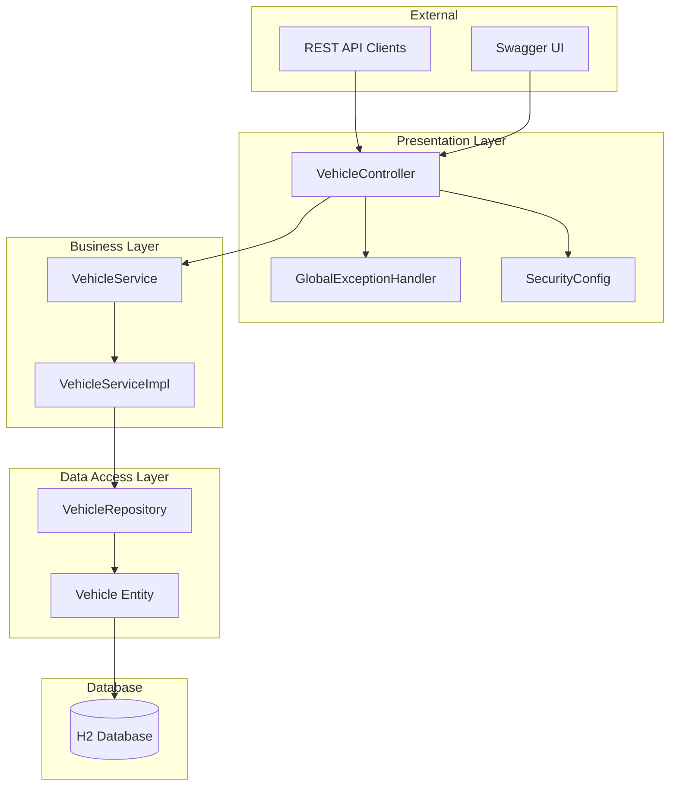
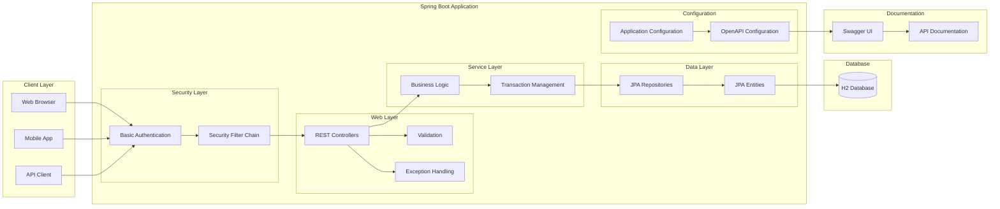
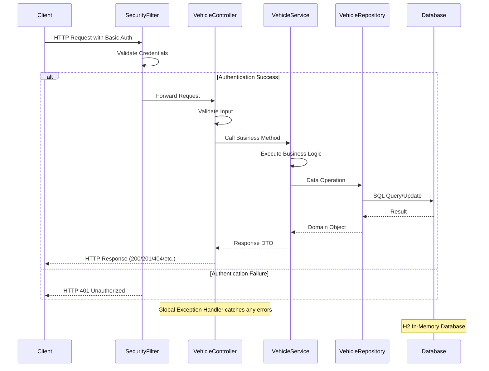
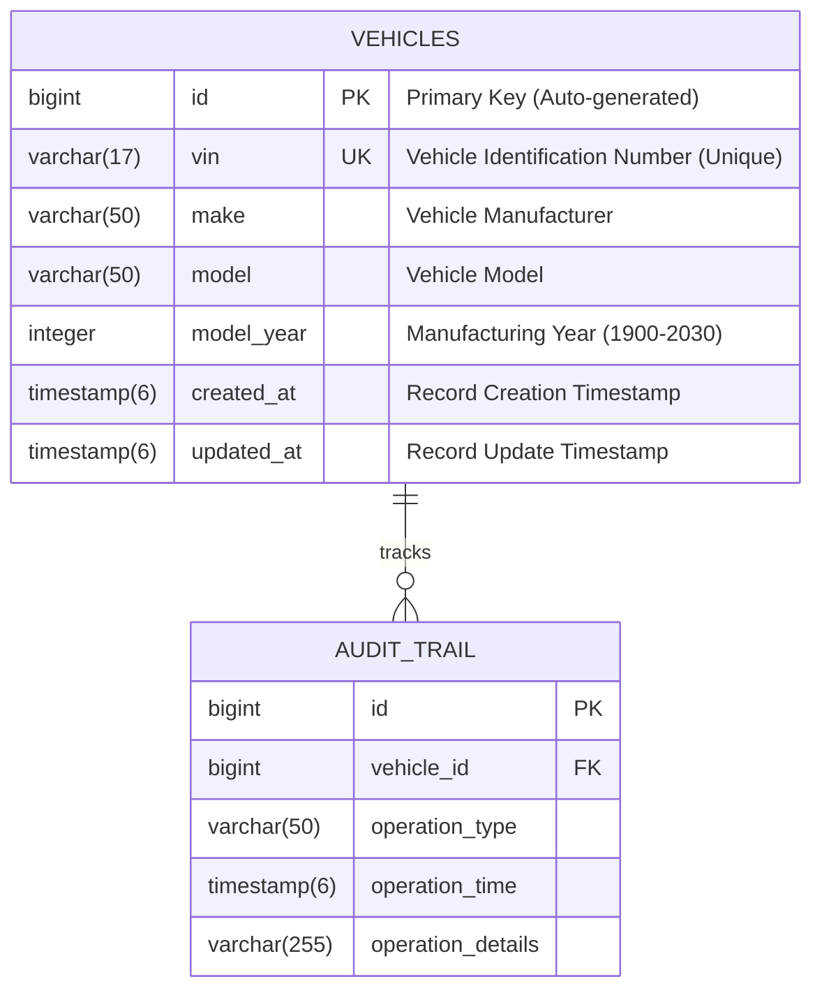

# Vehicle Management API

A comprehensive Spring Boot 3.2.0 REST API for managing vehicle information with Java 20, Basic Authentication, and OpenAPI documentation.

## 🚀 Features

- **Complete CRUD Operations** for Vehicle management
- **RESTful API** with proper HTTP status codes and error handling
- **Basic Authentication** for secure access
- **Data Validation** with comprehensive input validation
- **Search & Filtering** capabilities with pagination support
- **OpenAPI 3 Documentation** with Swagger UI integration
- **H2 In-Memory Database** for development and testing
- **Comprehensive Testing** with JUnit 5 and Spring Boot Test
- **Exception Handling** with global exception management
- **Logging** with SLF4J and Logback
- **Java 20** compatibility with modern language features

## 📋 Table of Contents

- [Architecture Overview](#architecture-overview)
- [System Architecture](#system-architecture)
- [API Flow Diagram](#api-flow-diagram)
- [Database Schema](#database-schema)
- [Getting Started](#getting-started)
- [API Documentation](#api-documentation)
- [Security](#security)
- [Testing](#testing)
- [Project Structure](#project-structure)
- [Technologies Used](#technologies-used)
- [Contributing](#contributing)

## 🏗️ Architecture Overview

The Vehicle Management API follows a layered architecture pattern with clear separation of concerns:



## 🏢 System Architecture



## 🔄 API Flow Diagram



## 🗄️ Database Schema



### Database Constraints

- **Primary Key**: `id` (Auto-incremented)
- **Unique Constraint**: `vin` (17-character VIN must be unique)
- **Not Null Constraints**: `vin`, `make`, `model`, `model_year`
- **Check Constraints**: 
  - `model_year` between 1900 and 2030
  - `vin` matches pattern `^[A-HJ-NPR-Z0-9]{17}$`
- **Automatic Timestamps**: `created_at` and `updated_at` managed by JPA

## 🚀 Getting Started

### Prerequisites

- **Java 20** or higher
- **Maven 3.8+** or use SDKMAN for installation
- **Git** for version control

### Installation

1. **Clone the repository**
   ```bash
   git clone <repository-url>
   cd SpringAPI
   ```

2. **Install Java 20 and Maven (using SDKMAN)**
   ```bash
   # Install SDKMAN
   curl -s "https://get.sdkman.io" | bash
   source "$HOME/.sdkman/bin/sdkman-init.sh"
   
   # Install Java 20 and Maven
   sdk install java 20.0.2-amzn
   sdk install maven 3.9.5
   
   # Use the installed versions
   sdk use java 20.0.2-amzn
   sdk use maven 3.9.5
   ```

3. **Build the project**
   ```bash
   mvn clean compile
   ```

4. **Run tests**
   ```bash
   mvn test
   ```

5. **Start the application**
   ```bash
   mvn spring-boot:run
   ```

The application will start on `http://localhost:8080`

### Quick Test

Test the API with curl:

```bash
# Get all vehicles (with basic auth)
curl -u admin:password http://localhost:8080/api/v1/vehicles

# Create a new vehicle
curl -X POST -u admin:password \
  -H "Content-Type: application/json" \
  -d '{
    "vin": "1HGBH41JXMN109186",
    "make": "Honda",
    "model": "Civic",
    "year": 2022
  }' \
  http://localhost:8080/api/v1/vehicles
```

## 📚 API Documentation

### OpenAPI/Swagger Integration

The API comes with comprehensive OpenAPI 3 documentation. Once the application is running, you can access:

- **Swagger UI**: `http://localhost:8080/swagger-ui/index.html`
- **OpenAPI JSON**: `http://localhost:8080/v3/api-docs`
- **OpenAPI YAML**: `http://localhost:8080/v3/api-docs.yaml`

### Main Endpoints

| Method | Endpoint | Description | Auth Required |
|--------|----------|-------------|---------------|
| `GET` | `/api/v1/vehicles` | Get all vehicles (paginated) | ✅ |
| `GET` | `/api/v1/vehicles/{id}` | Get vehicle by ID | ✅ |
| `GET` | `/api/v1/vehicles/vin/{vin}` | Get vehicle by VIN | ✅ |
| `POST` | `/api/v1/vehicles` | Create new vehicle | ✅ |
| `PUT` | `/api/v1/vehicles/{id}` | Update existing vehicle | ✅ |
| `DELETE` | `/api/v1/vehicles/{id}` | Delete vehicle | ✅ |
| `GET` | `/api/v1/vehicles/search` | Search vehicles | ✅ |
| `GET` | `/api/v1/vehicles/make/{make}` | Get vehicles by make | ✅ |

### Request/Response Examples

#### Create Vehicle Request
```json
{
  "vin": "1HGBH41JXMN109186",
  "make": "Honda",
  "model": "Civic",
  "year": 2022
}
```

#### Vehicle Response
```json
{
  "id": 1,
  "vin": "1HGBH41JXMN109186",
  "make": "Honda",
  "model": "Civic",
  "year": 2022,
  "createdAt": "2025-08-22T21:20:05.123456",
  "updatedAt": "2025-08-22T21:20:05.123456"
}
```

## 🔒 Security

### Basic Authentication

The API uses HTTP Basic Authentication with the following default credentials:

- **Username**: `admin`
- **Password**: `password`

### Security Configuration

```java
@Configuration
@EnableWebSecurity
public class SecurityConfig {
    // In-memory user store for demonstration
    // Production apps should use database or external auth providers
}
```

### Security Features

- **Password Encoding**: BCrypt password encoder
- **CORS Support**: Configured for cross-origin requests
- **CSRF Protection**: Disabled for REST API
- **Session Management**: Stateless (no sessions)
- **Public Endpoints**: Health check and API documentation

## 🧪 Testing

### Test Coverage

The project includes comprehensive testing with **26 test cases** covering:

- **Unit Tests**: Service layer business logic
- **Integration Tests**: Repository layer with H2 database
- **Web Layer Tests**: Controller endpoints
- **Security Tests**: Authentication and authorization

### Test Categories

1. **VehicleServiceImplTest** (14 tests)
   - CRUD operations
   - Business logic validation
   - Exception handling
   - Search functionality

2. **VehicleRepositoryTest** (11 tests)
   - Database operations
   - Query methods
   - Data integrity
   - Custom queries

3. **VehicleApiApplicationTests** (1 test)
   - Application context loading
   - Integration test

### Running Tests

```bash
# Run all tests
mvn test

# Run specific test class
mvn test -Dtest=VehicleServiceImplTest

# Run tests with coverage
mvn test jacoco:report
```

### Test Database

Tests use a separate H2 in-memory database configured in `application-test.properties`:

```properties
spring.datasource.url=jdbc:h2:mem:testdb
spring.jpa.hibernate.ddl-auto=create-drop
```

## 📁 Project Structure

```
SpringAPI/
├── .github/
│   └── copilot-instructions.md          # Development instructions
├── src/
│   ├── main/
│   │   ├── java/com/vehicle/api/
│   │   │   ├── VehicleApiApplication.java    # Main application class
│   │   │   ├── config/
│   │   │   │   └── OpenApiConfig.java        # OpenAPI configuration
│   │   │   ├── controller/
│   │   │   │   └── VehicleController.java    # REST controllers
│   │   │   ├── dto/                          # Data Transfer Objects
│   │   │   │   ├── VehicleCreateDto.java
│   │   │   │   ├── VehicleResponseDto.java
│   │   │   │   └── VehicleUpdateDto.java
│   │   │   ├── entity/
│   │   │   │   └── Vehicle.java              # JPA entities
│   │   │   ├── exception/                    # Exception handling
│   │   │   │   ├── GlobalExceptionHandler.java
│   │   │   │   ├── VehicleAlreadyExistsException.java
│   │   │   │   └── VehicleNotFoundException.java
│   │   │   ├── repository/
│   │   │   │   └── VehicleRepository.java    # Data access layer
│   │   │   ├── security/
│   │   │   │   └── SecurityConfig.java       # Security configuration
│   │   │   └── service/                      # Business logic layer
│   │   │       ├── VehicleService.java
│   │   │       └── VehicleServiceImpl.java
│   │   └── resources/
│   │       └── application.properties        # Main configuration
│   └── test/
│       ├── java/com/vehicle/api/
│       │   ├── VehicleApiApplicationTests.java
│       │   ├── controller/
│       │   │   └── VehicleControllerTest.java
│       │   ├── repository/
│       │   │   └── VehicleRepositoryTest.java
│       │   └── service/
│       │       └── VehicleServiceImplTest.java
│       └── resources/
│           └── application-test.properties   # Test configuration
├── target/                                   # Build output
├── pom.xml                                   # Maven configuration
└── README.md                                 # Project documentation
```

## 🛠️ Technologies Used

### Core Framework
- **Spring Boot 3.2.0** - Main framework
- **Spring Web** - REST API development
- **Spring Security** - Authentication and authorization
- **Spring Data JPA** - Data persistence layer

### Database
- **H2 Database** - In-memory database for development/testing
- **Hibernate** - ORM framework
- **HikariCP** - Connection pooling

### Documentation
- **SpringDoc OpenAPI 3** - API documentation
- **Swagger UI** - Interactive API documentation

### Testing
- **JUnit 5** - Testing framework
- **Spring Boot Test** - Integration testing
- **AssertJ** - Fluent assertions
- **Mockito** - Mocking framework

### Build & Development
- **Maven 3.9+** - Build tool and dependency management
- **Java 20** - Programming language
- **SLF4J + Logback** - Logging framework

### Validation & Utilities
- **Bean Validation (JSR-303)** - Input validation
- **Jackson** - JSON serialization/deserialization
- **Spring Boot Actuator** - Application monitoring

## 🔧 Configuration

### Application Properties

**Main Configuration** (`application.properties`)
```properties
# Server Configuration
server.port=8080
server.servlet.context-path=/

# Database Configuration
spring.datasource.url=jdbc:h2:mem:vehicledb
spring.datasource.username=sa
spring.datasource.password=
spring.h2.console.enabled=true

# JPA Configuration
spring.jpa.hibernate.ddl-auto=create-drop
spring.jpa.show-sql=true
```

**Test Configuration** (`application-test.properties`)
```properties
# Test Database
spring.datasource.url=jdbc:h2:mem:testdb
spring.jpa.hibernate.ddl-auto=create-drop
spring.jpa.show-sql=false

# Logging for Tests
logging.level.com.vehicle.api=WARN
```

### Environment-Specific Configuration

For different environments, create additional property files:
- `application-dev.properties` - Development environment
- `application-prod.properties` - Production environment
- `application-staging.properties` - Staging environment

## 🚀 Deployment

### Building for Production

```bash
# Create production JAR
mvn clean package -DskipTests

# Run the JAR
java -jar target/vehicle-api-1.0.0.jar
```

### Docker Deployment

Create a `Dockerfile`:

```dockerfile
FROM openjdk:20-jre-slim

COPY target/vehicle-api-1.0.0.jar app.jar

EXPOSE 8080

ENTRYPOINT ["java", "-jar", "/app.jar"]
```

Build and run:

```bash
docker build -t vehicle-api .
docker run -p 8080:8080 vehicle-api
```

### Production Considerations

1. **Database**: Replace H2 with production database (PostgreSQL, MySQL)
2. **Security**: Use external authentication provider (OAuth2, LDAP)
3. **Monitoring**: Add application monitoring (Micrometer, Prometheus)
4. **Logging**: Configure centralized logging (ELK stack)
5. **Configuration**: Use external configuration management

## 🤝 Contributing

1. Fork the repository
2. Create a feature branch: `git checkout -b feature/amazing-feature`
3. Commit your changes: `git commit -m 'Add amazing feature'`
4. Push to the branch: `git push origin feature/amazing-feature`
5. Open a Pull Request

### Development Guidelines

- Follow Java coding standards
- Write comprehensive tests for new features
- Update documentation for API changes
- Use conventional commit messages
- Ensure all tests pass before submitting PR

## 📜 License

This project is licensed under the MIT License - see the [LICENSE](LICENSE) file for details.

## 📞 Support

For support and questions:

- Create an issue in the GitHub repository
- Contact the development team
- Check the API documentation at `/swagger-ui/index.html`

---

## 🎯 Project Status

- ✅ **Compilation**: Successfully compiles with Java 20
- ✅ **Testing**: All 26 tests passing
- ✅ **Security**: Basic Authentication implemented
- ✅ **Documentation**: Comprehensive OpenAPI documentation
- ✅ **Database**: H2 in-memory database working
- ✅ **CRUD Operations**: Complete vehicle management functionality
- ✅ **Validation**: Input validation and error handling
- ✅ **Search**: Advanced search and filtering capabilities

**Build Status**: ✅ BUILD SUCCESS  
**Test Status**: ✅ 26/26 TESTS PASSING  
**Java Version**: ✅ Java 20 Compatible  
**Spring Boot Version**: ✅ 3.2.0

---

*Last updated: August 22, 2025*
